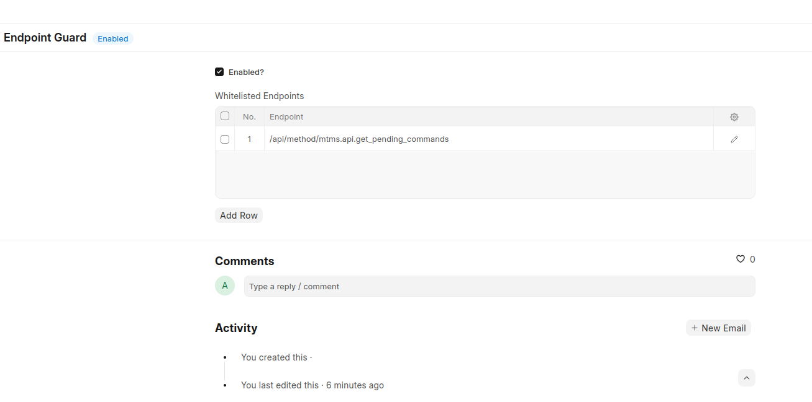

### FAG
This project came to light due to the need to control rest api endpoint access.

In frappe, anyone can access the endpoints of any app or doctype, I wanted a way to control what is exposed to the calling clients.



### Installation

You can install this app using the [bench](https://github.com/frappe/bench) CLI:

```bash
cd $PATH_TO_YOUR_BENCH
bench get-app https://github.com/DonnC/frappe-api-guard.git --branch develop
bench install-app fag
```

### Usage
Go on awesome-bar and search `Endpoint guard`. You can toggle the functionality on/off.

Add the endpoints you want to be accessible as in the screenshot above.

### Roadmap
* [ ] **Role based access** Add an option to allow adding only a set of roles to access the endpoint.

### Contributing

This app uses `pre-commit` for code formatting and linting. Please [install pre-commit](https://pre-commit.com/#installation) and enable it for this repository:

```bash
cd apps/fag
pre-commit install
```

Pre-commit is configured to use the following tools for checking and formatting your code:

- ruff
- eslint
- prettier
- pyupgrade

### License
MIT
