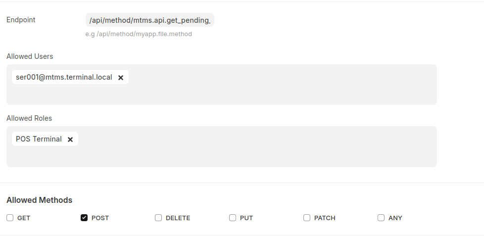

# 🛡️ Frappe API Guard (FAG)

**Granular API Endpoint Access Control for Frappe | ERPNext & Custom Apps**

**FAG** is a lightweight yet powerful endpoint access control system for Frappe & ERPNext. It lets you **whitelist**, **restrict**, and **fine-tune** access to your server-side API methods — down to the HTTP method, user, role, and more.

If you’ve ever wanted to control *exactly* who can call which API method in your Frappe app (and how), FAG fills the gap.


Checkout raw demo video [here](docs/demo-raw.webm)

## 🚨 Why FAG?

By default, Frappe’s security model focuses on:

* **DocType Permissions** (who can read, write, create, delete documents)
* **`allow_guest` & whitelisted methods** (basic API openness)
* **Role-based Permission Rules**

However:

* Whitelisted methods are **either open to everyone** (guest) or **require a login**, but offer no *granular filtering*.
* There’s no built-in *per-endpoint, per-method, per-user* control.
* You cannot easily **restrict certain API endpoints to specific roles, users, or HTTP verbs** without writing custom decorators everywhere.

**FAG** plugs this hole.


## ✨ Features

* ✅ **Endpoint Whitelisting** – Only allow defined API paths; block the rest.
* ✅ **HTTP Method Control** – Restrict an endpoint to only `GET`, `POST`, `DELETE`, etc.
* ✅ **User & Role Filters** – Allow access only for specific users or roles.
* ✅ **Optional Fine-Grained Rules** – Attach an advanced access profile (`Access Policy`) to an endpoint.
* ✅ **Fast Lookup via Caching** – All rules are cached in Redis for lightning-fast request checks.
* ✅ **Extendable** – Add rate limits, time-based access windows, or IP restrictions later.
* ✅ **Admin-Friendly** – All configuration is in the Frappe desk via simple DocTypes.


## 🏗 Architecture

FAG introduces two main DocTypes:

### 1️⃣ FAG Settings
* `Enabled?` – Turn the guard on/off
* `Throw on Guard?` - Throw exception or return 403 when guard catches a restricted endpoint

### 2️⃣ Access Policy (Fine-Grained Guard)

Holds the **list of allowed API endpoints** and their basic restrictions:

* Endpoint Path (e.g., `/api/method/my_app.my_method`)
* Allowed Users (multi-select link to User)
* Allowed Roles (multi-select link to Role)
* Allowed HTTP Methods (multi-select: `GET`, `POST`, `DELETE`, etc.)
* *(Future)* Rate limits, allowed hours, IP address restrictions, etc.


## ⚡ How It Works

1. **Admin configures** the endpoints in **FAG Access Policy**.
2. (Optional) Links an **Access Policy** for specific users/roles/methods.
3. On every API request:

   * FAG checks if **Guard is enabled**.
   * Validates endpoint is in whitelist.
   * Validates HTTP method.
   * If Access Policy exists → validates user/role against it.
   * If checks fail → returns HTTP 403 Forbidden or throws.


## 🖥 Example Use Cases

* **Restrict developer APIs** to only specific API keys/users.
* **Lock sensitive endpoints** like `/api/method/frappe.client.delete` to only admins.
* **Limit webhook listeners** to POST-only.


## 🔍 Why Not Just Use Built-in Frappe Permissions?

* **Frappe permissions** are DocType-centric, not endpoint-centric.
* They don’t easily apply to *arbitrary whitelisted methods*.
* No built-in way to check allowed HTTP verbs per method.
* FAG **requires zero code changes** to your existing methods — just configure in Desk.

## 🚀 Installation

```bash
bench get-app https://github.com/DonnC/fag.git
bench --site yoursite install-app fag
bench restart
```


## ⚙️ Usage

1. **Open Desk** → Search for **"FAG Settings"**.
2. Enable the guard 
3. On Awesomebar → Search for **"FAG Access Policy"** 
4. Add your allowed endpoints.
5. (Optional) Add allowed users/roles and or methods.
6. When done, you will have your policy as in the screenshot above.

## 🛡 Example

**Allow `/api/method/my_app.api.do_something`**

* Method: `POST` only
* Access Policy: `Admins Only` (Role: System Manager)


## 🗺 Roadmap
* [ ] Rate limiting
* [ ] IP-based restrictions
* [ ] Time-based access windows
* [ ] Audit logs for blocked requests
* [ ] CLI import/export of guard rules


## 📜 License

MIT — free to use, modify, and distribute.


## 🤝 Contributing

Pull requests are welcome!

1. Fork the repo
2. Create a feature branch
3. Submit a PR


If you like **FAG**, star ⭐ the repo and help spread the word!

